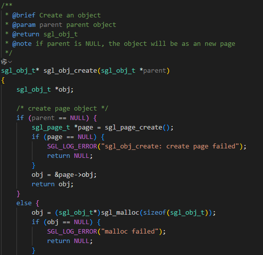
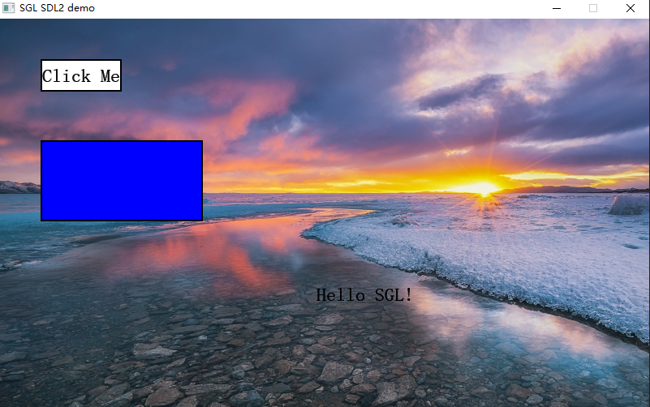
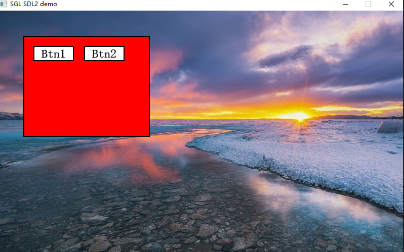
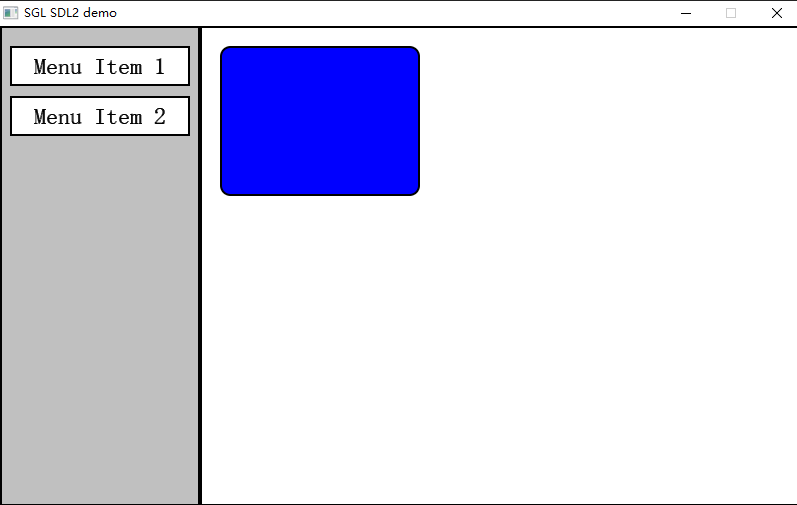
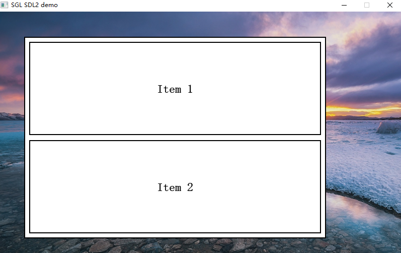

# SGL Page 与 Rect 控件详细应用指南

## 1. 简介

为什么在第一讲我们先讲这个呢？因为后续使用一系列控件的时候我将都会把这个控件创建在页或，者一个矩形容器里面这样可以方便我们后续对于动画的设计以及载入不同的画面非常的重要在 SGL 图形库中，`Page` 和 `Rect` 是两个最基础且最重要的**容器类控件**：

- **`Page`**：作为**顶层容器**，代表一个完整的屏幕页面。
- **`Rect`**：作为**通用矩形容器**，用于组织和布局其他控件（包括按钮、标签、嵌套容器等）。

两者都支持作为父对象容纳子控件，是构建复杂用户界面的核心组件。

---

## 2. Page 控件详解

### 2.1 概念

`Page` 是 SGL 的**根级容器**。所有 UI 元素最终都必须归属于某个 `Page`。  


翻阅SGL的库文件可知，如果你在创建一个控件的时候，父对象设置得是NULL他会**自动创建一个page**，让控键显示page上面，如果用户自己创建 `Page` 时，**须显式调用 `sgl_screen_load()` 才能显示在屏幕上**。

> ⚠️ 注意：仅创建 `Page` 不足以使其可见，必须调用 `sgl_screen_load(page)`。

---

### 2.2 创建方式

```c
sgl_obj_t* page = sgl_obj_create(NULL);
```
---

创建后必须调用 `sgl_screen_load()` 将其设为当前屏幕内容：

```c
sgl_obj_t* page = sgl_obj_create(NULL);
sgl_screen_load(page);  // 必须调用！否则页面不可见
```

> 🔹 `sgl_screen_load()` 会将指定对象设为“屏幕根对象”，后续所有绘制操作都将基于此页面。

---

### 2.3 作为父容器使用

`Page` 可作为任意控件的父对象，子控件可以控制显示到该页面：

```c
sgl_obj_t* page = sgl_obj_create(NULL);
sgl_screen_load(page);

// 添加子控件
sgl_obj_t* button = sgl_button_create(page);
sgl_obj_set_pos(button, 50, 50);
sgl_obj_set_size(button, 100, 40);
sgl_button_set_text(button, "Click Me");
sgl_button_set_font(button, &song23);

sgl_obj_t* label = sgl_label_create(page);
sgl_obj_set_pos(label, 50, 100);
sgl_label_set_text(label, "Hello SGL!");
sgl_label_set_font(label, &song23);

sgl_obj_t* rect = sgl_rect_create(page);
sgl_obj_set_pos(rect, 50, 150);
sgl_obj_set_size(rect, 200, 100);
sgl_rect_set_color(rect, SGL_COLOR_BLUE);
```



---

### 2.4 样式设置

`Page` 支持两种背景样式：

#### 设置纯色背景

```c
void sgl_page_set_color(sgl_obj_t* obj, sgl_color_t color);
// 示例：
sgl_page_set_color(page, SGL_COLOR_WHITE);
```

#### 设置图片背景

```c
void sgl_page_set_pixmap(sgl_obj_t* obj, const sgl_pixmap_t *pixmap);
// 示例：
sgl_page_set_pixmap(page, &background_pixmap);
```

> 📌 底层绘制逻辑由 `sgl_page_construct_cb()` 实现：  
> - 若设置了 pixmap，则绘制图片背景；  
> - 否则填充指定颜色。

---

## 3. Rect 控件详解

### 3.1 概念

`Rect` 是一个**通用矩形容器**，主要用于：

- 分组相关控件（如表单区域、卡片、侧边栏等）
- 构建嵌套布局结构
- 作为布局管理的载体（配合水平/垂直/网格布局）

它可以作为 `Page`的子对象，也可以作为其他控件的父对象。

---

### 3.2 创建方式

```c
sgl_obj_t* sgl_rect_create(sgl_obj_t* parent);
```

示例：

```c
sgl_obj_t* container = sgl_rect_create(page);
sgl_obj_set_pos(container, 10, 10);
sgl_obj_set_size(container, 300, 200);
sgl_rect_set_color(container, SGL_COLOR_LIGHT_GRAY);
```

---

### 3.3 作为父容器使用（嵌套布局）

`Rect` 最强大的能力是作为**布局容器**：

```c
sgl_obj_t* page = sgl_obj_create(NULL);
sgl_screen_load(page);

sgl_obj_t* panel = sgl_rect_create(page);
sgl_obj_set_pos(panel, 50, 50);
sgl_obj_set_size(panel, 250, 200);
sgl_rect_set_color(panel, SGL_COLOR_RED);

sgl_obj_t* btn1 = sgl_button_create(panel);
sgl_obj_set_pos(btn1, 20, 20);
sgl_obj_set_size(btn1, 80, 30);
sgl_button_set_text(btn1, "Btn1");
sgl_button_set_font(btn1, &song23);

sgl_obj_t* btn2 = sgl_button_create(panel);
sgl_obj_set_pos(btn2, 120, 20);
sgl_obj_set_size(btn2, 80, 30);
sgl_button_set_text(btn2, "Btn2");
sgl_button_set_font(btn2, &song23);
```


> ✅ 所有子控件的位置都是相对于 `Rect` 容器的左上角。

---

### 3.4 典型应用场景：页面分区

将页面划分为 header / content / footer 区域：

```c
sgl_obj_t* page = sgl_obj_create(NULL);
sgl_screen_load(page);

// 顶部栏
sgl_obj_t* header = sgl_rect_create(page);
sgl_obj_set_pos(header, 0, 0);
sgl_obj_set_size(header, 800, 60);
sgl_rect_set_color(header, SGL_COLOR_DARK_GRAY);

// 内容区
sgl_obj_t* content = sgl_rect_create(page);
sgl_obj_set_pos(content, 0, 60);
sgl_obj_set_size(content, 800, 360);
sgl_rect_set_color(content, SGL_COLOR_WHITE);

// 底部栏
sgl_obj_t* footer = sgl_rect_create(page);
sgl_obj_set_pos(footer, 0, 420);
sgl_obj_set_size(footer, 800, 60);
sgl_rect_set_color(footer,SGL_COLOR_BLUE );
```

---

## 4. 复杂嵌套结构示例

通过多层 `Rect` 嵌套，可构建现代 UI 布局（如侧边栏 + 主内容区）：

```c
sgl_obj_t* main_page = sgl_obj_create(NULL);
sgl_screen_load(main_page);

// 主容器
sgl_obj_t* main_content = sgl_rect_create(main_page);
sgl_obj_set_pos(main_content, 0, 0);
sgl_obj_set_size(main_content, 800, 480);
sgl_rect_set_color(main_content, SGL_COLOR_WHITE);

// 侧边栏
sgl_obj_t* sidebar = sgl_rect_create(main_content);
sgl_obj_set_pos(sidebar, 0, 0);
sgl_obj_set_size(sidebar, 200, 480);
sgl_rect_set_color(sidebar, SGL_COLOR_LIGHT_GRAY);

sgl_obj_t* menu1 = sgl_button_create(sidebar);
sgl_obj_set_pos(menu1, 10, 20);
sgl_obj_set_size(menu1, 180, 40);
sgl_button_set_text(menu1, "Menu Item 1");
 sgl_button_set_font(menu1, &song23); 

sgl_obj_t* menu2 = sgl_button_create(sidebar);
sgl_obj_set_pos(menu2, 10, 70);
sgl_obj_set_size(menu2, 180, 40);
sgl_button_set_text(menu2, "Menu Item 2");
sgl_button_set_font(menu2, &song23); 

// 主内容区
sgl_obj_t* content_area = sgl_rect_create(main_content);
sgl_obj_set_pos(content_area, 200, 0);
sgl_obj_set_size(content_area, 600, 480);
sgl_rect_set_color(content_area, SGL_COLOR_WHITE);

// 卡片组件
sgl_obj_t* card = sgl_rect_create(content_area);
sgl_obj_set_pos(card, 20, 20);
sgl_obj_set_size(card, 200, 150);
sgl_rect_set_color(card, SGL_COLOR_BLUE);
sgl_rect_set_radius(card, 10);  // 圆角

sgl_obj_t* title = sgl_label_create(card);
sgl_obj_set_pos(title, 10, 10);
sgl_label_set_text(title, "Card Title");
sgl_label_set_font(title, &song23);
sgl_label_set_text_color(title, SGL_COLOR_WHITE);
sgl_label_set_text_align(title, 0);
```




---

## 5. 布局管理

`Page` 和 `Rect` 均支持自动布局系统，无需手动设置每个子控件位置。

### 5.1 布局类型

```c
sgl_obj_set_layout(container, SGL_LAYOUT_HORIZONTAL); // 水平排列
sgl_obj_set_layout(container, SGL_LAYOUT_VERTICAL);   // 垂直排列
sgl_obj_set_layout(container, SGL_LAYOUT_GRID);       // 网格布局（需额外配置）
```
>❗ 使用自动布局不能使用**sgl_obj_set_size、sgl_obj_set_pos**这两个接口
---
### 5.2 自动布局示例（垂直）

```c
sgl_obj_t* v_container = sgl_rect_create(page);
sgl_obj_set_pos(v_container, 50, 50);
sgl_obj_set_size(v_container, 600, 400);
sgl_obj_set_layout(v_container, SGL_LAYOUT_VERTICAL);
sgl_obj_set_margin(v_container, 10); // 子控件间距

// 子控件宽度设为 0 表示“填满容器”
sgl_obj_t* item1 = sgl_button_create(v_container);
sgl_button_set_text(item1, "Item 1");
sgl_button_set_font(item1,&song23);

sgl_obj_t* item2 = sgl_button_create(v_container);
sgl_button_set_text(item2, "Item 2");
sgl_button_set_font(item2,&song23);


```



> ✨ 使用布局系统可大幅提升代码可维护性，尤其适合动态内容或响应式设计。

---

## 6. 总结

| 项目        | 建议                                                    |
| --------- | ----------------------------------------------------- |
| **页面初始化** | 必须调用 `sgl_screen_load(page)` 才能显示页面                   |
| **结构清晰性** | `Page` 作顶层，`Rect` 作逻辑分组容器                             |
| **布局复用**  | 将常用布局（如卡片、表单）封装为函数                                    |
| **背景设置**  | 优先使用 `sgl_page_set_color()` 或 `sgl_page_set_pixmap()` |
| **内存管理**  | 不再使用的控件应及时调用 `sgl_obj_delete()` 释放资源                  |

- `Page` 是 SGL 应用的**入口点**，必须创建并加载；
- `Rect` 是构建 UI 结构的**万能积木**，支持嵌套与布局；
- 合理组合二者，可高效实现从简单界面到复杂仪表盘的各类需求；
- **切记：创建 Page ≠ 显示 Page，务必调用 `sgl_screen_load()`！**


---