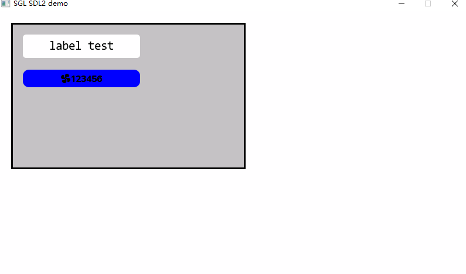

## 1. 简介

`Label`（标签）是图形用户界面中最基础的显示控件之一。  
在 **SGL（Simple Graphics Library）** 中，标签主要用于显示静态文本信息，支持文本对齐、背景颜色、圆角、透明度等多种样式设置。

> ⚠️ 标签是**终端控件**，不能包含子控件。~~不能作为父~~

---

## 2. 创建标签

使用 sgl_label_create() 创建标签：

```c
sgl_obj_t* label = sgl_label_create(parent);
```

- `parent`：父对象（可为 `NULL`，表示顶层控件）
---
## 3. 常用属性设置

### 3.1 位置与尺寸

```c
sgl_obj_set_pos(label, x, y);           // 设置位置 
sgl_obj_set_size(label, width, height); // 设置宽高`
```

### 3.2 文本样式

```c
sgl_label_set_text(sgl_obj_t *obj, const char *text);              // 设置文本 
sgl_label_set_font(sgl_obj_t *obj, const sgl_font_t *font);               // 设置字体 
sgl_label_set_text_color(sgl_obj_t *obj, sgl_color_t color);     // 文本颜色 
sgl_label_set_text_align(sgl_obj_t *obj, sgl_align_type_t align);    // 对齐方式`
```

### 3.3 背景与透明度

```c
sgl_label_set_bg_color(sgl_obj_t *obj, sgl_color_t color);  // 背景颜色 
sgl_label_set_alpha(sgl_obj_t *obj, uint8_t alpha);                      // 透明度 (0~255)`
```

### 3.4 圆角与边框

```c
sgl_label_set_radius(sgl_obj_t *obj, uint8_t radius);                       // 圆角半径 
sgl_label_set_border_width(sgl_obj_t *obj, uint8_t width);                 // 边框宽度 
sgl_label_set_border_color(sgl_obj_t *obj, sgl_color_t color);    // 边框颜色
```

### 3.5 设置ICON

```c
sgl_label_set_icon(sgl_obj_t *obj, const sgl_icon_pixmap_t *icon);
```

### 3.6 文本偏移

```c
sgl_label_set_text_offset(sgl_obj_t *obj, int16_t x, int16_t y); // 文本y偏移量
```

---

## 5. 应用示例


```c
    #define SGL_ICON_E65D_USER_NAME "\xEE\x99\x9D"
    
    sgl_obj_t* page = sgl_obj_create(NULL);
    sgl_screen_load(page);

    // 容器
    sgl_obj_t* container = sgl_rect_create(page);
    sgl_obj_set_pos(container, 20, 20);
    sgl_obj_set_size(container, 400, 250);
    sgl_rect_set_color(container, SGL_COLOR_LIGHT_GRAY);
    // 示例标签
    sgl_obj_t* label1 = sgl_label_create(container);
    sgl_obj_set_pos(label1, 20, 20);
    sgl_obj_set_size(label1, 200, 40);
    sgl_label_set_text(label1, "label test");
    sgl_label_set_font(label1, &consolas23);
    sgl_label_set_text_color(label1, SGL_COLOR_BLACK);
    sgl_label_set_bg_color(label1, SGL_COLOR_WHITE);
    sgl_label_set_radius(label1, 5);

    // icon标签
    sgl_obj_t* label2 = sgl_label_create(container);
    sgl_obj_set_pos(label2, 20, 80);
    sgl_obj_set_size(label2, 200, 30);
    sgl_label_set_text(label2,SGL_ICON_E65D_USER_NAME "123456");//SGL使用Icon图标可以使用UTF-8的编码进行显示不过这样写的显示出来的Icon颜色只能是和字体一样。当然字符也可以使用UTF-8编码直接显示。
    sgl_label_set_font(label2, &iconfont_24);
    sgl_label_set_text_color(label2, SGL_COLOR_BLACK);
    sgl_label_set_bg_color(label2, SGL_COLOR_BLUE);
    sgl_label_set_radius(label2, 10);
```



---


> 📘 相关头文件路径：
> 
> - 标签 API：`sgl/source/widgets/label/sgl_label.h`
> - 核心对象：`sgl/source/include/sgl_core.h`