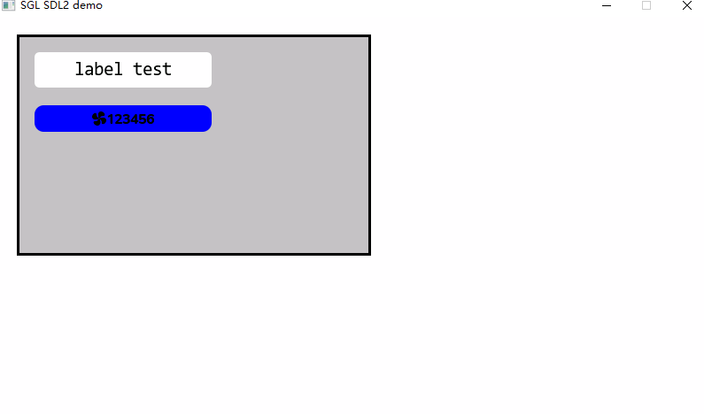

# SGL Label 控件应用指南

## 1. 简介

`Label`（标签）是图形用户界面中最基础的**静态文本显示控件**。  
在 **SGL（Simple Graphics Library）** 中，`Label` 主要用于展示不可编辑的文本信息，支持丰富的样式配置。

> ⚠️ **重要特性**：
> - 是**终端控件（leaf widget）**，**不能包含子控件**
> - **不能作为父对象**创建其他控件
> - 支持文本、背景、圆角、透明度、对齐、偏移等
> - 文本可直接嵌入 Icon（图标字体）字符显示

---

## 2. 创建 Label

使用 `sgl_label_create()` 创建标签控件：

```c
sgl_obj_t* sgl_label_create(sgl_obj_t* parent);
```

- **`parent`**：父对象指针（如 `Page` 或 `Rect`），不可为 `NULL`（必须挂载到有效容器）

示例：
```c
sgl_obj_t* label = sgl_label_create(page);
```

---

## 3. 属性设置接口

所有设置函数的第一个参数均为 `sgl_obj_t* obj`，即通过 `sgl_label_create()` 返回的对象指针。

### 3.1 文本与字体

| 功能 | 函数原型 | 参数说明 |
|------|--------|--------|
| 设置文本内容 | `void sgl_label_set_text(sgl_obj_t *obj, const char *text)` | `text`：C 字符串（支持 UTF-8 编码，可嵌入 Icon 字符） |
| 获取文本内容 | `char* sgl_label_get_text(sgl_obj_t *obj)` | 返回当前文本指针 |
| 设置文本缓冲区 | `void sgl_label_set_text_buffer(sgl_obj_t *obj, char *buf, uint16_t buf_size)` | 使用用户提供的缓冲区，避免动态内存 |
| 格式化文本（静态缓冲区） | `void sgl_label_set_text_fmt(sgl_obj_t *obj, const char *fmt, ...)` | 需先调用 `set_text_buffer()` |
| 格式化文本（动态内存） | `void sgl_label_set_text_fmt_dynamic(sgl_obj_t *obj, const char *fmt, ...)` | 自动分配内存 |
| 设置字体 | `void sgl_label_set_font(sgl_obj_t *obj, const sgl_font_t *font)` | `font`：字体指针（**必须设置，否则运行时断言失败**） |
| 设置文本颜色 | `void sgl_label_set_text_color(sgl_obj_t *obj, sgl_color_t color)` | `color`：文本前景色（如 `SGL_COLOR_BLACK`） |

> 🔔 **注意**：源码中 `sgl_label_construct_cb` 包含 `SGL_ASSERT(label->font != NULL)`，未设字体会导致程序终止。

### 3.2 图标（Icon）支持

SGL 支持通过 **文本字符串内嵌图标字体字符** 的方式显示图标，此时图标颜色与文本颜色一致：

```c
// 图标字体需用户自行生成并提供（如 iconfont），注册方式与普通字体一致
sgl_obj_t* label = sgl_label_create(page);
sgl_label_set_text(label, "\xEE\x99\x9D" "123456"); // UTF-8 内嵌图标字符
sgl_label_set_font(label, &iconfont_24);            // 用户提供的图标字体
sgl_label_set_text_color(label, SGL_COLOR_BLACK);
```

> 💡 提示：字符也可以使用 UTF-8 编码直接显示（中文等）。
> 💡 若需要**独立图标控件**（可单独设置图标、与文本分离），请使用 `sgl_icon_create()`（见 `widgets/icon/sgl_icon.h`）。

### 3.3 对齐与偏移

| 功能 | 函数原型 | 参数说明 |
|------|--------|--------|
| 设置文本对齐 | `void sgl_label_set_text_align(sgl_obj_t *obj, sgl_align_type_t align)` | `align`：对齐方式，见下方枚举 |
| 设置文本偏移 | `void sgl_label_set_text_offset(sgl_obj_t *obj, int8_t offset_x)` | `offset_x`：文本绘制位置的 X 方向像素偏移 |

> ⚠️ **接口变更**：旧版本 `sgl_label_set_text_offset(obj, offset_x, offset_y)` 双参数已改为**单参数 `offset_x`**（如需 X/Y 双向偏移请使用 `sgl_label_ext` 控件）。

```c
// 对齐枚举（sgl_align_type_t）
SGL_ALIGN_CENTER       // 居中（默认）
SGL_ALIGN_TOP_MID      // 顶部居中
SGL_ALIGN_TOP_LEFT     // 左上
SGL_ALIGN_TOP_RIGHT    // 右上
SGL_ALIGN_BOT_MID      // 底部居中
SGL_ALIGN_BOT_LEFT     // 左下
SGL_ALIGN_BOT_RIGHT    // 右下
SGL_ALIGN_LEFT_MID     // 左侧垂直居中
SGL_ALIGN_RIGHT_MID    // 右侧垂直居中
```

### 3.4 背景与透明度

| 功能 | 函数原型 | 参数说明 |
|------|--------|--------|
| 设置背景颜色 | `void sgl_label_set_bg_color(sgl_obj_t *obj, sgl_color_t color)` | `color`：背景填充色；调用后自动启用背景绘制（`bg_flag = 1`） |
| 设置透明度 | `void sgl_label_set_alpha(sgl_obj_t *obj, uint8_t alpha)` | `alpha`：整体透明度（0=透明，255=不透明） |

### 3.5 圆角与边框

| 功能 | 函数原型 | 参数说明 |
|------|--------|--------|
| 设置圆角半径 | `void sgl_label_set_radius(sgl_obj_t *obj, uint8_t radius)` | `radius`：圆角像素值（内部调用 `sgl_obj_fix_radius()` 修正） |
| 设置边框宽度 | ❌ **不支持** | `Label` 控件**不提供** `set_border_width` 接口 |
| 设置边框颜色 | ❌ **不支持** | `Label` 控件**不提供** `set_border_color` 接口 |

> 📌 **声明**：  
> 根据 `sgl_label.h` 和 `sgl_label.c` 源码，**Label 控件不支持独立边框设置**。  
> 若需边框效果，可通过以下方式实现：
> - 使用带边框的 `Rect` 作为容器
> - 自定义绘制逻辑（继承扩展）

### 3.6 长文本滚动（Long Mode，需开启动画）

```c
void sgl_label_set_long_mode(sgl_obj_t *obj, uint32_t speed_ms, bool flag);
// speed_ms: 滚动速度（毫秒/像素）
// flag: true=开启长文本滚动，false=关闭
```
> 🔔 需在 `sgl_config.h` 中开启 `CONFIG_SGL_ANIMATION`。

---

## 4. 应用示例

```c
    sgl_obj_t* page = sgl_obj_create(NULL);
    sgl_screen_load(page);

    // 容器
    sgl_obj_t* container = sgl_rect_create(page);
    sgl_obj_set_pos(container, 20, 20);
    sgl_obj_set_size(container, 400, 250);
    sgl_rect_set_color(container, SGL_COLOR_LIGHT_GRAY);
    // 示例标签
    sgl_obj_t* label1 = sgl_label_create(container);
    sgl_obj_set_pos(label1, 20, 20);
    sgl_obj_set_size(label1, 200, 40);
    sgl_label_set_text(label1, "label test");
    sgl_label_set_font(label1, &consolas23);
    sgl_label_set_text_color(label1, SGL_COLOR_BLACK);
    sgl_label_set_bg_color(label1, SGL_COLOR_WHITE);
    sgl_label_set_radius(label1, 5);

    // icon标签（文本内嵌图标字体字符）
    sgl_obj_t* label2 = sgl_label_create(container);
    sgl_obj_set_pos(label2, 20, 80);
    sgl_obj_set_size(label2, 200, 30);
    sgl_label_set_text(label2, SGL_ICON_E65D_USER_NAME "123456"); // 图标颜色与文本一致
    sgl_label_set_font(label2, &iconfont_24);   // 用户提供的图标字体
    sgl_label_set_text_color(label2, SGL_COLOR_BLACK);
    sgl_label_set_bg_color(label2, SGL_COLOR_BLUE);
    sgl_label_set_radius(label2, 10);
```



---

## 5. 动态文本示例（格式化）

```c
    static char text_buf[32];   // 用户缓冲区
    sgl_obj_t* label = sgl_label_create(page);
    sgl_obj_set_pos(label, 20, 20);
    sgl_label_set_font(label, &consolas23);
    sgl_label_set_text_buffer(label, text_buf, sizeof(text_buf));
    sgl_label_set_text_fmt(label, "Count: %d", 42);   // 写入缓冲区并刷新
```

---

## 6. 相关 Demo

可点击跳转到 SGL_DEMO 中的完整示例源码进行对照学习：

- [Label 完整示例 sgl_label_demo.c](SGL_DEMO/sgl_label_demo.c) — 文本、字体、对齐、背景、圆角、图标内嵌等全部接口演示

> 💡 也可在 `sgl_demo.h` 中打开 `SGD_ENABLE_LABEL` 开关宏后编译运行。

---

## 7. 总结

- ✅ **始终设置字体**：避免因未初始化字体导致断言崩溃。
- ✅ **合理使用 Icon 字体**：将图标编码嵌入文本字符串，简化 UI 构建。
- ✅ **利用文本偏移微调布局**：当文字垂直不对齐时，用 `set_text_offset()` 调整。
- ✅ **动态文本用缓冲区**：频繁更新的文本优先用 `set_text_buffer()` + `set_text_fmt()`，避免内存碎片。
- ⚠️ **不要尝试添加子控件**：Label 是终端控件，`sgl_button_create(label)` 等操作无效。
- 🎨 **背景替代边框**：若需“边框”效果，可使用浅色背景 + 内边距模拟。

---
> 📘 **相关头文件路径**  
> - Label API：`sgl/source/widgets/label/sgl_label.h`  
> - Label 扩展（旋转等）：`sgl/source/widgets/label_ext/sgl_label_ext.h`  
> - 核心对象：`sgl/source/include/sgl_core.h`
---
