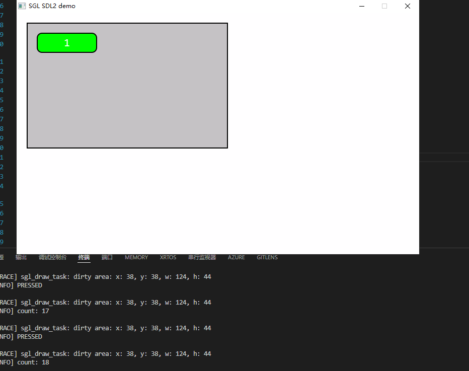

# SGL Button 控件应用指南

## 1. 简介

`Button`（按钮）是图形用户界面中最基础且高频使用的**交互控件**。  
在 **SGL（Simple Graphics Library）** 中，按钮支持文本、图标、背景图片、圆角、边框、透明度等多种样式，并具备按下时的视觉反馈（如缩放效果）。

> ⚠️ 按钮是**终端控件**，不能包含子控件，仅可作为叶节点使用。

---

## 2. 创建按钮

### 2.1 创建函数

```c
sgl_obj_t* sgl_button_create(sgl_obj_t* parent);
```

- **`parent`**：父对象指针（如 `Page` 或 `Rect`）
  - 若传入 `NULL`，则创建为顶层控件（不推荐，建议挂载到页面）

> ✅ 创建后自动设置为 **可点击**（`sgl_obj_set_clickable`）和 **可弹性缩放**（`sgl_obj_set_flexible`）

---

## 3. 属性设置接口

所有 setter 函数的第一个参数均为 `sgl_obj_t* obj`，即通过 `sgl_button_create()` 返回的对象指针。

### 3.1 背景与外观

| 功能     | 函数原型                                                                     | 参数说明                                          |
| ------ | ------------------------------------------------------------------------ | --------------------------------------------- |
| 设置背景颜色 | `void sgl_button_set_color(sgl_obj_t *obj, sgl_color_t color)`           | `color`：填充色（作用于 `button->rect.color`）         |
| 设置透明度  | `void sgl_button_set_alpha(sgl_obj_t *obj, uint8_t alpha)`               | `alpha`：0~255，255 为完全不透明                      |
| 设置边框宽度 | `void sgl_button_set_border_width(sgl_obj_t *obj, uint8_t width)`        | `width`：边框像素宽度（作用于 `button->rect.border`）     |
| 设置边框颜色 | `void sgl_button_set_border_color(sgl_obj_t *obj, sgl_color_t color)`    | `color`：边框颜色（作用于 `button->rect.border_color`） |
| 设置背景图片 | `void sgl_button_set_pixmap(sgl_obj_t *obj, const sgl_pixmap_t *pixmap)` | `pixmap`：背景图指针（作用于 `button->rect.pixmap`）     |
| 设置圆角半径 | `void sgl_button_set_radius(sgl_obj_t *obj, uint8_t radius)`             | `radius`：圆角像素值，内部调用 `sgl_obj_fix_radius()` 修正 |

### 3.2 文本属性

| 功能 | 函数原型 | 参数说明 |
|------|--------|--------|
| 设置显示文本 | `void sgl_button_set_text(sgl_obj_t *obj, const char *text)` | `text`：C 字符串（若为 `NULL` 则不绘制文本） |
| 设置文本颜色 | `void sgl_button_set_text_color(sgl_obj_t *obj, sgl_color_t color)` | `color`：文本前景色 |
| 设置文本对齐 | `void sgl_button_set_text_align(sgl_obj_t *obj, uint8_t align)` | `align`：对齐方式（如 `SGL_ALIGN_CENTER`） |
| 设置字体 | `void sgl_button_set_font(sgl_obj_t *obj, const sgl_font_t *font)` | `font`：字体指针（若未设置，仅图标可见） |

### 3.3 图标

| 功能 | 函数原型 | 参数说明 |
|------|--------|--------|
| 设置图标 | `void sgl_button_set_icon(sgl_obj_t *obj, const sgl_icon_pixmap_t *icon)` | `icon`：图标指针（类型为 `sgl_icon_pixmap_t`） |

> 📌 **文本 + 图标布局**：  
> 若同时设置 `text` 和 `icon`，图标绘制在左侧，文本右移 `icon->width + 2` 像素。

---

## 4. 事件处理机制

### 4.1 支持的事件类型

| 事件类型                 | 触发时机   | 行为                                                       |
| -------------------- | ------ | -------------------------------------------------------- |
| `SGL_EVENT_PRESSED`  | 用户按下按钮 | 按钮若为 `flexible`，会触发 `sgl_obj_size_zoom(obj, 2)`（放大 2 像素） |
| `SGL_EVENT_RELEASED` | 用户释放按钮 | 恢复原始尺寸，并执行用户回调                                           |

> ✅ **推荐在 `SGL_EVENT_RELEASED` 中处理业务逻辑**，避免误触。

### 4.2 注册事件回调

```c
// 设置回调函数（可选 user_data）
sgl_obj_set_event_cb(button, event_handler, user_data);

// 显式启用点击（虽默认已启用，但显式调用更安全）
sgl_obj_set_clickable(button);
```

> 🔒 **禁用按钮交互**：  
```c
 sgl_obj_set_unclickable(button);
```

### 4.3 程序化触发事件

可通过 `sgl_event_send_obj()` 主动模拟用户操作：

```c
sgl_event_send_obj(button, SGL_EVENT_PRESSED);
// ... 延时或状态判断 ...
sgl_event_send_obj(button, SGL_EVENT_RELEASED);
```
#### 应用场景：
- 键盘快捷键映射到按钮功能
- 定时器或状态机触发操作

> 💡 **重要提示**：  
> - 不要连续调用 `PRESSED` 和 `RELEASED`，否则无法看到按下时的缩放动画。  
> - 适用于：外部物理按键映射、定时器触发、状态机驱动等场景。

---

## 5. 应用示例

```c
static int click_count = 0;
static void on_button_event(sgl_event_t* event) {
    switch (event->type) {
        case SGL_EVENT_PRESSED:
            SGL_LOG_INFO("Button PRESSED\n");
            break;
        case SGL_EVENT_RELEASED:
            click_count++;
            SGL_LOG_INFO("Click count: %d\n", click_count);
            break;
    }
}

    
    // 创建主页面
    sgl_obj_t* page = sgl_obj_create(NULL);
    sgl_page_set_color(page, SGL_COLOR_WHITE);
    sgl_screen_load(page);

    // 创建容器
    sgl_obj_t* container = sgl_rect_create(page);
    sgl_obj_set_pos(container, 20, 20);
    sgl_obj_set_size(container, 400, 250);
    sgl_rect_set_color(container, SGL_COLOR_LIGHT_GRAY);

    // 创建按钮
    sgl_obj_t* btn = sgl_button_create(container);
    sgl_obj_set_pos(btn, 20, 20);
    sgl_obj_set_size(btn, 120, 40);
    sgl_button_set_text(btn, "Click Me");
    sgl_button_set_font(btn, &consolas23);
    sgl_button_set_color(btn, SGL_COLOR_GREEN);
    sgl_button_set_text_color(btn, SGL_COLOR_WHITE);
    sgl_button_set_radius(btn, 10);
    sgl_button_set_border_width(btn, 1);
    sgl_obj_set_event_cb(btn, on_button_event, NULL);


```



---

## 6. 高级用法（参考）

- [基于按钮的滑动菜单](demo/sliding_menu_demo.md)
- [按钮点击动画演示](demo/button_anim.c)

---

## 7. 总结

- ✅ **始终设置字体**：若显示文本，务必调用 `sgl_button_set_font()`。
- ✅ **合理使用图标+文本**：图标提升识别度，文本增强可读性。
- ✅ **视觉反馈明确**：利用默认的“按下缩放”效果，或自定义 `PRESSED/RELEASED` 样式。
- ✅ **避免过小尺寸**：确保按钮可被用户准确点击（建议 ≥ 40×40 像素）。

---
> 📘 **相关头文件路径**  
> - buttoon API：`sgl/source/widgets/button/sgl_button.h`  
> - 事件系统：`sgl/source/include/sgl_event.h`  
> - 核心对象：`sgl/source/include/sgl_core.h`
---