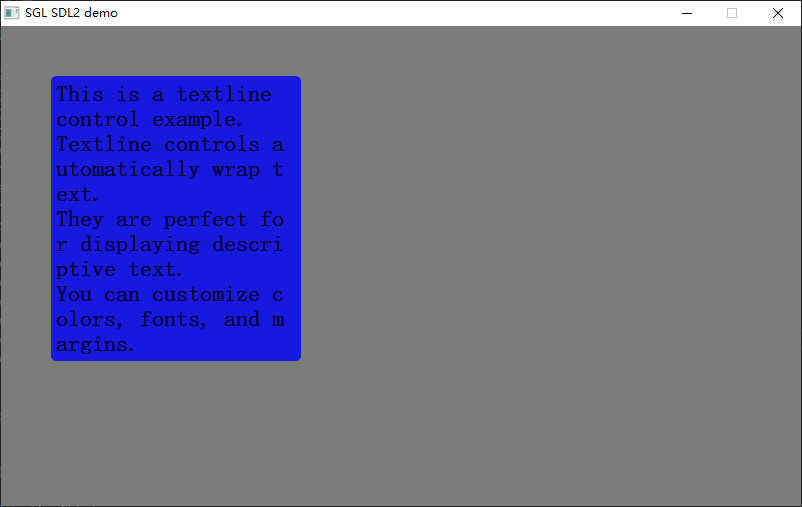
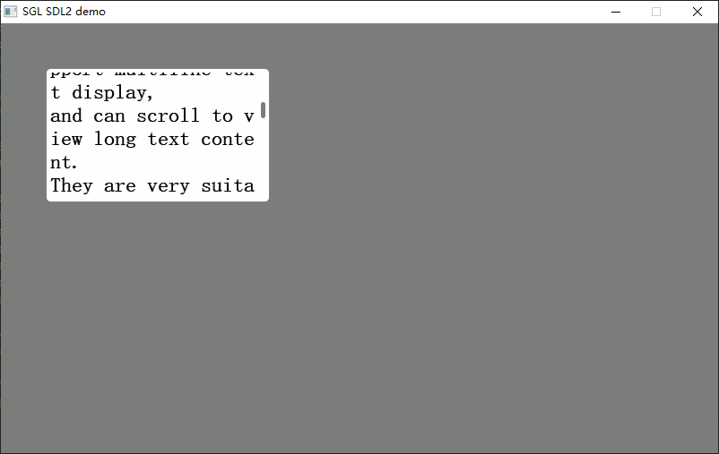
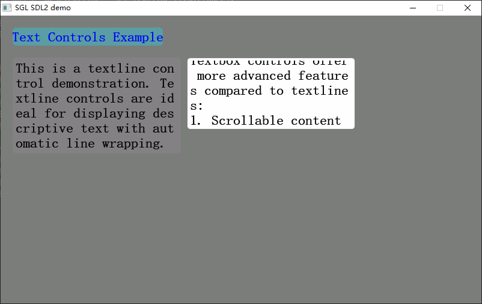

# SGL Textline 和 Textbox 控件应用指南

## 1. 简介

在 **SGL 图形库** 中，文本显示是构建用户界面的核心功能之一。为满足不同场景的文本展示需求，SGL 提供了两种主要的文本控件：

- **`Textline`（文本行）控件**：轻量级多行文本显示，支持自动换行。
- **`Textbox`（文本框）控件**：功能更丰富的多行文本控件，支持滚动查看长文本。

两者均继承自 SGL 基础对象体系，可无缝集成布局管理、样式设置、事件响应等能力。

---

## 2. Textline 控件详解

### 2.1 概念

`Textline` 是一个**轻量级多行文本显示控件**，适用于描述性文字、说明标签等场景。  
支持：
- 自动换行
- 背景色、透明度、圆角
- 行间距与边缘边距控制

> <span style="background:#d3f8b6"><font color="#c00000">⚠️ **注意**：`Textline 不支持滚动，sgl_obj_set_size(textline, w, h)中高度将不能使用，testline会根据设置的w自己调整高度直到文本显示完。</font></span>

### 2.2 创建方式

```c
sgl_obj_t* sgl_textline_create(sgl_obj_t* parent);
```
- **`parent`**：父对象指针（如 `Page` 或 `Rect`），若为顶层可传入页面对象

### 2.3 基础属性设置（完整接口）

所有设置函数的第一个参数均为 `sgl_obj_t* obj`，即通过 `sgl_textline_create()` 返回的对象指针。

| 功能 | 函数原型 | 参数说明 |
|------|--------|--------|
| 设置文本内容 | `void sgl_textline_set_text(sgl_obj_t *obj, const char *text)` | `text`：要显示的 C 字符串（支持 `\n` 换行） |
| 设置字体 | `void sgl_textline_set_text_font(sgl_obj_t *obj, const sgl_font_t *font)` | `font`：指向字体结构体的指针（**必须设置，否则断言失败**） |
| 设置文本颜色 | `void sgl_textline_set_text_color(sgl_obj_t *obj, sgl_color_t color)` | `color`：文本颜色（如 `SGL_COLOR_BLACK`） |
| 设置背景颜色 | `void sgl_textline_set_bg_color(sgl_obj_t *obj, sgl_color_t color)` | `color`：背景色；调用后自动启用背景绘制（`bg_flag = true`） |
| 设置透明度 | `void sgl_textline_set_alpha(sgl_obj_t *obj, uint8_t alpha)` | `alpha`：透明度值（0=完全透明，255=不透明） |
| 设置圆角 | `void sgl_textline_set_radius(sgl_obj_t *obj, uint8_t radius)` | `radius`：圆角半径（像素），内部会调用 `sgl_obj_fix_radius()` 修正 |
| 设置边缘边距 | `void sgl_textline_set_edge_margin(sgl_obj_t *obj, uint8_t margin)` | `margin`：文本内容距离控件边缘的像素数 |
| 设置行间距 | `void sgl_textline_set_line_margin(sgl_obj_t *obj, uint8_t margin)` | `margin`：行与行之间的额外垂直间距（像素） |

> 🔔 **重要提示**：**字体必须显式设置**，否则运行时会触发断言错误！

### 2.4 Textline 使用示例

```c
sgl_obj_t *page = sgl_obj_create(NULL);
sgl_page_set_color(page, sgl_rgb(127,127, 127));

// 创建一个带背景的 Textline
sgl_obj_t *textline = sgl_textline_create(page);
sgl_obj_set_pos(textline, 50, 50);
sgl_obj_set_size(textline, 250, 150);
sgl_textline_set_text(textline,
    "This is a textline control example.\n"
    "Textline controls automatically wrap text.\n"
    "They are perfect for displaying descriptive text.\n"
    "You can customize colors, fonts, and margins.");
sgl_textline_set_text_font(textline, &song23);
sgl_textline_set_text_color(textline, SGL_COLOR_BLACK);
sgl_textline_set_bg_color(textline, SGL_COLOR_BLUE);
sgl_textline_set_radius(textline, 8);
sgl_textline_set_alpha(textline, 200);
sgl_textline_set_edge_margin(textline, 10);
sgl_textline_set_line_margin(textline, 2);
/* 载入页面 */
sgl_screen_load(page);
```



---

## 3. Textbox 控件详解

### 3.1 概念

`Textbox` 是一个**功能增强型多行文本控件**，专为**长文本内容**设计。  
核心特性：
- 支持**垂直滚动**查看内容
- 可设置边框、背景、圆角
- 适合日志、帮助文档、文章等场景

### 3.2 创建方式

```c
sgl_obj_t* sgl_textbox_create(sgl_obj_t* parent);
```
- **`parent`**：父对象指针

### 3.3 基础属性设置（完整接口）

所有设置函数的第一个参数均为 `sgl_obj_t* obj`，即通过 `sgl_textbox_create()` 返回的对象指针。

| 功能 | 函数原型 | 参数说明 |
|------|--------|--------|
| 设置文本内容 | `void sgl_textbox_set_text(sgl_obj_t *obj, const char *text)` | `text`：要显示的 C 字符串（支持 `\n` 换行） |
| 设置文本颜色 | `void sgl_textbox_set_text_color(sgl_obj_t *obj, sgl_color_t color)` | `color`：文本前景色 |
| 设置字体 | `void sgl_textbox_set_text_font(sgl_obj_t *obj, const sgl_font_t *font)` | `font`：字体指针（**必须设置，否则断言失败**） |
| 设置背景颜色 | `void sgl_textbox_set_bg_color(sgl_obj_t *obj, sgl_color_t color)` | `color`：背景填充色（作用于 `textbox->bg.color`） |
| 设置圆角 | `void sgl_textbox_set_radius(sgl_obj_t *obj, uint8_t radius)` | `radius`：容器圆角半径（作用于 `textbox->bg.radius`） |
| 设置边框颜色 | `void sgl_textbox_set_border_color(sgl_obj_t *obj, sgl_color_t color)` | `color`：边框颜色（作用于 `textbox->bg.border_color`） |
| 设置边框宽度 | `void sgl_textbox_set_border_width(sgl_obj_t *obj, uint8_t width)` | `width`：边框像素宽度（作用于 `textbox->bg.border`） |
| 设置背景图片 | `void sgl_textbox_set_pixmap(sgl_obj_t *obj, const sgl_pixmap_t *pixmap)` | `pixmap`：背景图指针（作用于 `textbox->bg.pixmap`） |
| 设置行间距 | `void sgl_textbox_set_line_margin(sgl_obj_t *obj, uint8_t margin)` | `margin`：行间额外垂直间距（像素） |

> 💡 注意：`Textbox` 的背景、边框等样式通过其内部 `sgl_draw_rect_t bg` 成员管理。

### 3.4 Textbox 使用示例

```c
sgl_obj_t *page = sgl_obj_create(NULL);
sgl_page_set_color(page, sgl_rgb(127,127, 127));
// 创建一个带边框的文本框
sgl_obj_t *textbox = sgl_textbox_create(page);
sgl_obj_set_pos(textbox, 50, 220);
sgl_obj_set_size(textbox, 250, 150);
sgl_textbox_set_text(textbox,
    "This is a textbox control example.\n"
    "Textbox controls support multiline text display,\n"
    "and can scroll to view long text content.\n"
    "They are very suitable for displaying instructions,\n"
    "log information, or other lengthy text content.\n"
    "By setting borders and background colors,\n"
    "textboxes can look more attractive and readable."
);
sgl_textbox_set_text_font(textbox, &song23);
sgl_textbox_set_text_color(textbox, SGL_COLOR_BLACK);
sgl_textbox_set_bg_color(textbox, SGL_COLOR_WHITE);
sgl_textbox_set_border_color(textbox, SGL_COLOR_GRAY);
sgl_textbox_set_border_width(textbox, 1);
sgl_textbox_set_radius(textbox, 5);
sgl_textbox_set_line_margin(textbox, 3);
/* 载入页面 */
sgl_screen_load(page);

```



---

## 4. Textline 与 Textbox 对比

| 特性 | Textline | Textbox |
|------|----------|---------|
| 文本行数 | 多行 | 多行 |
| 自动换行 | ✅ 支持 | ✅ 支持 |
| 滚动支持 | ❌ 不支持 | ✅ 支持 |
| 边框设置 | ❌ 不支持 | ✅ 支持（`border_color`, `border_width`） |
| 背景图支持 | ❌ 不支持 | ✅ 支持（`set_pixmap`） |
| 行间距设置 | ✅ 支持 | ✅ 支持 |
| 圆角/背景 | ✅ 支持 | ✅ 支持 |
| 典型使用场景 | 描述性文本、标签、提示 | 日志、帮助文档、长篇文章、可编辑区域 |

---
## 5. 完整示例

```c
   /* 创建主页面 */
    sgl_obj_t *page = sgl_obj_create(NULL);
    sgl_page_set_color(page, sgl_rgb(127,127, 127));
    // 标题标签
    sgl_obj_t *titleLabel = sgl_label_create(page);
    sgl_obj_set_pos(titleLabel, 20, 20);
    sgl_obj_set_size(titleLabel, 250, 30);
    sgl_label_set_text(titleLabel, "Text Controls Example");
    sgl_label_set_font(titleLabel, &song23);
    sgl_label_set_text_color(titleLabel, SGL_COLOR_BLUE);
    sgl_label_set_bg_color(titleLabel, SGL_COLOR_CADET_BLUE);
    sgl_label_set_radius(titleLabel, 5);
    // 描述 Textline
    sgl_obj_t *descTextline = sgl_textline_create(page);
    sgl_obj_set_pos(descTextline, 20, 70);
    sgl_obj_set_size(descTextline, 280, 60);
    sgl_textline_set_text(descTextline,
        "This is a textline control demonstration. "
        "Textline controls are ideal for displaying descriptive text with automatic line wrapping.");
    sgl_textline_set_text_font(descTextline, &song23);
    sgl_textline_set_text_color(descTextline, SGL_COLOR_BLACK);
    sgl_textline_set_bg_color(descTextline, SGL_COLOR_GRAY);
    sgl_textline_set_radius(descTextline, 5);
    sgl_textline_set_edge_margin(descTextline, 5);
    sgl_textline_set_line_margin(descTextline, 2);
    // 内容 Textbox
    sgl_obj_t *contentTextbox = sgl_textbox_create(page);
    sgl_obj_set_pos(contentTextbox, 310, 70);
    sgl_obj_set_size(contentTextbox, 280, 120);
    sgl_textbox_set_text(contentTextbox,
        "This is a textbox control demonstration.\n\n"
        "Textbox controls offer more advanced features compared to textlines:\n"
        "1. Scrollable content for long texts\n"
        "2. Customizable borders\n"
        "3. Better suited for large amounts of text\n\n"
        "Some key differences:\n"
        "- Textline: Best for short descriptions\n"
        "- Textbox: Ideal for logs, articles, or editable content\n\n"
        "Both controls support:\n"
        "- Custom fonts and colors\n"
        "- Background colors\n"
        "- Rounded corners\n"
        "- Line spacing adjustment"
    );
    sgl_textbox_set_text_font(contentTextbox, &song23);
    sgl_textbox_set_text_color(contentTextbox, SGL_COLOR_BLACK);
    sgl_textbox_set_bg_color(contentTextbox, SGL_COLOR_WHITE);
    sgl_textbox_set_border_color(contentTextbox, SGL_COLOR_GRAY);
    sgl_textbox_set_border_width(contentTextbox, 1);
    sgl_textbox_set_radius(contentTextbox, 5);
    sgl_textbox_set_line_margin(contentTextbox, 2);
    /* 载入页面 */
    sgl_screen_load(page);
```




---
> 📘 **相关头文件路径**  
> - textline API：`sgl/source/widgets/textline/sgl_textline.h
> - textbox API：`sgl/source/widgets/textbox/sgl_textbox.h`   
> - 核心对象：`sgl/source/include/sgl_core.h`
---