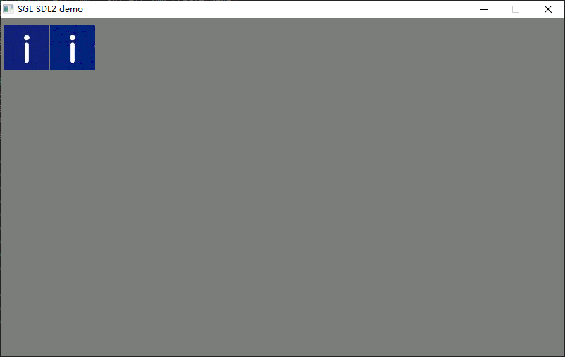

# External Image 控件应用指南

## 1. 简介

`ExtImg`（外部图片控件）是 SGL 提供的一种**高效加载外部存储图像**的专用控件，特别适用于资源受限的嵌入式系统。它支持：

- 从 **外部 Flash、SD 卡、网络缓冲区等非 RAM 区域** 读取图像数据
- 支持 **原始格式（RGB565/RGB888 等）** 和 **RLE 压缩格式**
- 可设置 **透明度（Alpha）**
- 通过自定义读取函数（`read_ops`）实现灵活的数据访问

> ✅ 典型应用场景：图标显示、背景图、动态加载资源包中的图片等。

---

## 2. 核心概念

### 2.1 图像描述结构：`sgl_pixmap_t`

所有图像必须先定义为 `sgl_pixmap_t` 结构体：

```c
typedef struct sgl_pixmap {
    uint32_t width  : W;   // 图像宽度（像素）
    uint32_t height : H;   // 图像高度（像素）
    uint32_t format : SGL_PIXMAP_FMT_XXXX;    // 图像格式（见下表）
    const uint8_t *bitmap;  // 图像数据指针（可指向 Flash 地址）
} sgl_pixmap_t;
```

#### 支持的图像格式（`format` 字段）

| 宏定义                         | 说明                 |
| --------------------------- | ------------------ |
| `SGL_PIXMAP_FMT_RGB332`     | 8-bit RGB (3-3-2)  |
| `SGL_PIXMAP_FMT_RGB565`     | 16-bit RGB (5-6-5) |
| `SGL_PIXMAP_FMT_RGB888`     | 24-bit RGB (8-8-8) |
| `SGL_PIXMAP_FMT_RLE_RGB332` | RLE 压缩的 RGB332     |
| `SGL_PIXMAP_FMT_RLE_RGB565` | RLE 压缩的 RGB565     |
| `SGL_PIXMAP_FMT_RLE_RGB888` | RLE 压缩的 RGB888     |

> ⚠️ 注意：必须指定具体格式。
>同时需要注意的是你在设置图像格式的时候必须和你在sgl_config.h 文件中定义的CONFIG_SGL_PANEL_PIXEL_DEPTH一致。典型错误：
>~~<font color="#c00000"><u><span style="background:#d3f8b6">#define  CONFIG_SGL_PANEL_PIXEL_DEPTH                      16</span></u></font>~~
>
>~~<font color="#c00000"><u><span style="background:#fff88f">uint32_t format : SGL_PIXMAP_FMT_RGB888;</span></u></font>~~
>定义16bit 实际却用888的。

---

## 3. ExtImg 控件接口

### 3.1 创建控件

```c
sgl_obj_t* sgl_ext_img_create(sgl_obj_t* parent);
```
- **`parent`**：父对象（如 `Page` 或 `Rect`）
- 返回值：指向新创建的 `ExtImg` 对象的指针

### 3.2 设置图像数据

```c
void sgl_ext_img_set_pixmap(sgl_obj_t *obj, const sgl_pixmap_t *pixmap);
```
- **`obj`**：由 `sgl_ext_img_create()` 返回的对象
- **`pixmap`**：指向已初始化的 `sgl_pixmap_t` 结构体

### 3.3 设置自定义读取函数（关键！）

```c
void sgl_ext_img_set_read_ops(sgl_obj_t *obj, 
    void (*read)(const uint8_t *addr, uint8_t *out, uint32_t len_bytes));
```
- **`read`**：用户实现的读取回调函数，用于从外部存储（如 Flash）拷贝数据到 RAM
  - `addr`：源地址（即 `pixmap->bitmap + offset`）
  - `out`：目标缓冲区（SGL 内部提供）
  - `len_bytes`：需要读取的字节数

> 💡 若图像已在 RAM 中（如全局数组），可传 `NULL` 跳过此设置。

### 3.4 设置透明度

```c
void sgl_ext_img_set_alpha(sgl_obj_t *obj, uint8_t alpha);
```
- **`alpha`**：透明度（0 = 完全透明，255 = 完全不透明）
- 默认值为 `SGL_ALPHA_MAX`（即 255）

---
## 4. 使用示例

### 4.1 准备图像数据

假设你有两个图像资源：

- `gImage_5`：未压缩的 RGB565 格式图像（位于 Flash）
- `img_xinxi_yiban_mian__yuanshidaxiao__64x64`：RLE 压缩的 RGB565 图像（位于 Flash）

### 4.2 实现 Flash 读取函数

```c
// 用户需实现此函数以从外部 Flash 读取数据
void flash_port_read_data_from_flash(const uint8_t *addr, uint8_t *buf, uint32_t len)
{
    // 示例：调用硬件 Flash 读取 API
    Flash_Read((uint32_t)addr, buf, len);
}
```

### 4.3 创建并配置 ExtImg 控件

```c
extern const unsigned char gImage_5[];
extern const unsigned char img_xinxi_yiban_mian__yuanshidaxiao__64x64[];//一般图像文件会放置在其他文件里面，所以在调用的文件里面记得声明一下
// 定义未压缩图像
sgl_pixmap_t test_pixmap = {
    .width  = 64,
    .height = 64,
    .bitmap = gImage_5,
    .format = SGL_PIXMAP_FMT_RGB565,
};

// 定义 RLE 压缩图像
sgl_pixmap_t test_pixmap2 = {
    .width  = 64,
    .height = 64,
    .bitmap = img_xinxi_yiban_mian__yuanshidaxiao__64x64,
    .format = SGL_PIXMAP_FMT_RLE_RGB565,
};

// 创建第一个外部图片控件
sgl_obj_t *ext_img = sgl_ext_img_create(page);
sgl_obj_set_pos(ext_img, 5 ,10);
sgl_obj_set_size(ext_img, 64, 64); // 注意：应设为图像实际尺寸,但是实际上这个接口已经没用了，不知道以后会不会更新，就先设置为图片大小
sgl_ext_img_set_pixmap(ext_img, &test_pixmap);
sgl_ext_img_set_read_ops(ext_img, flash_port_read_data_from_flash);

// 创建第二个外部图片控件（RLE 压缩）
sgl_obj_t *ext_img2 = sgl_ext_img_create(page);
sgl_obj_set_pos(ext_img2, 70, 10);
sgl_obj_set_size(ext_img2, 64, 64); // 同上
sgl_ext_img_set_pixmap(ext_img2, &test_pixmap2);
sgl_ext_img_set_read_ops(ext_img2, flash_port_read_data_from_flash);
```



> 💡 需要注意的一点是压缩图片，不再会支持图片的缩放，同时压缩图片在用WeGui的工具取膜的时候需要勾选交换大小端否则图片会画异。

---

## 5. 工作原理简述

1. 当 `ExtImg` 需要绘制时，SGL 调用其 `construct_fn`（即 `sgl_ext_img_construct_cb`）
2. 根据 `pixmap->format` 判断是否为 RLE 压缩：
   - **非 RLE**：按行读取像素数据（通过 `read_ops` 或直接访问）
   - **RLE**：使用内部 RLE 解压器逐行解码
3. 将解码后的像素与目标缓冲区混合（考虑 `alpha` 值）
4. 最终写入帧缓冲区

---

## 6. 总结

- ✅ **RLE 压缩节省空间**：对于颜色单一的图标，RLE 可大幅减小 Flash 占用
- ✅ **读取函数健壮性**：确保 `flash_port_read_data_from_flash` 能处理任意地址和长度
- ✅ **避免频繁创建/销毁**：`ExtImg` 适合静态图像；动态图建议复用控件并更新 `pixmap`

---
> 📘 **相关头文件路径**  
> - ext_img API：`sgl/source/widgets/ext_img/sgl_ext_img.h   
> - 核心对象：`sgl/source/include/sgl_core.h`
---